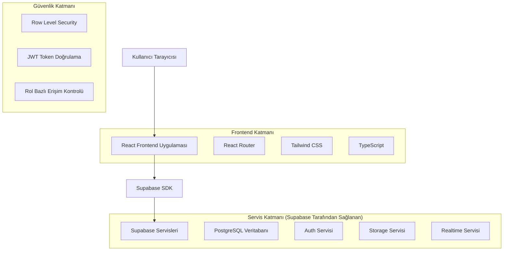
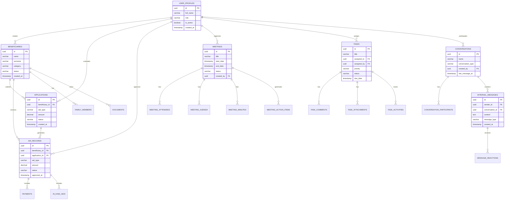

# Teknik Mimari Dokümanı - Yardım Kuruluşu Yönetim Sistemi

## 1. Mimari Tasarım



## 2. Teknoloji Açıklaması

### Frontend
- **React@18**: Modern component-based UI framework
- **TypeScript@5**: Type-safe JavaScript development
- **Tailwind CSS@3**: Utility-first CSS framework
- **React Router@6**: Client-side routing
- **Vite@4**: Fast build tool and development server
- **React Hook Form**: Form state management
- **React Query/TanStack Query**: Server state management
- **Lucide React**: Icon library

### Backend Servisleri
- **Supabase**: Backend-as-a-Service platform
  - PostgreSQL veritabanı
  - Authentication servisi
  - File storage
  - Realtime subscriptions
  - Row Level Security (RLS)

### Geliştirme Araçları
- **ESLint**: Code linting
- **Prettier**: Code formatting
- **TypeScript**: Type checking

## 3. Route Tanımları

| Route | Amaç |
|-------|-------|
| `/` | Ana sayfa, dashboard ve genel bakış |
| `/login` | Kullanıcı giriş sayfası |
| `/beneficiaries` | İhtiyaç sahipleri listesi ve yönetimi |
| `/beneficiaries/:id` | İhtiyaç sahibi detay sayfası |
| `/beneficiaries/new` | Yeni ihtiyaç sahibi ekleme |
| `/applications` | Başvurular listesi ve yönetimi |
| `/applications/:id` | Başvuru detay sayfası |
| `/applications/new` | Yeni başvuru oluşturma |
| `/aid-records` | Yardım kayıtları listesi |
| `/aid-records/:id` | Yardım kaydı detayları |
| `/meetings` | Toplantılar listesi ve takvim görünümü |
| `/meetings/:id` | Toplantı detay sayfası |
| `/meetings/new` | Yeni toplantı oluşturma |
| `/tasks` | Görevler listesi ve kanban board |
| `/tasks/:id` | Görev detay sayfası |
| `/tasks/new` | Yeni görev oluşturma |
| `/messages` | İç mesajlaşma sistemi |
| `/messages/:conversationId` | Konuşma detay sayfası |
| `/profile` | Kullanıcı profil sayfası |
| `/users` | Kullanıcı yönetimi (admin) |
| `/reports` | Raporlar ve analizler |
| `/settings` | Sistem ayarları |

## 4. API Tanımları

### 4.1 Supabase Client API

Supabase SDK kullanılarak doğrudan veritabanı işlemleri gerçekleştirilir:

#### Authentication API
```typescript
// Giriş yapma
const { data, error } = await supabase.auth.signInWithPassword({
  email: 'user@example.com',
  password: 'password'
});

// Çıkış yapma
const { error } = await supabase.auth.signOut();

// Kullanıcı bilgilerini alma
const { data: { user } } = await supabase.auth.getUser();
```

#### Database API
```typescript
// İhtiyaç sahiplerini listeleme
const { data, error } = await supabase
  .from('beneficiaries')
  .select('*')
  .order('created_at', { ascending: false });

// Yeni başvuru oluşturma
const { data, error } = await supabase
  .from('applications')
  .insert({
    beneficiary_id: 'uuid',
    aid_type: 'cash',
    amount: 1000,
    description: 'Acil nakit yardım'
  });

// Görev güncelleme
const { data, error } = await supabase
  .from('tasks')
  .update({ status: 'completed' })
  .eq('id', taskId);
```

#### Storage API
```typescript
// Dosya yükleme
const { data, error } = await supabase.storage
  .from('documents')
  .upload('folder/filename.pdf', file);

// Dosya indirme URL'si alma
const { data } = supabase.storage
  .from('documents')
  .getPublicUrl('folder/filename.pdf');
```

#### Realtime API
```typescript
// Yeni mesajları dinleme
const channel = supabase
  .channel('messages')
  .on('postgres_changes', {
    event: 'INSERT',
    schema: 'public',
    table: 'internal_messages',
    filter: `conversation_id=eq.${conversationId}`
  }, (payload) => {
    console.log('Yeni mesaj:', payload.new);
  })
  .subscribe();
```

### 4.2 Tip Tanımları

```typescript
// Kullanıcı profili
interface UserProfile {
  id: string;
  full_name: string;
  display_name: string;
  role: 'super_admin' | 'admin' | 'manager' | 'coordinator' | 'operator' | 'viewer';
  department?: string;
  position?: string;
  phone?: string;
  avatar_url?: string;
  is_active: boolean;
  created_at: string;
  updated_at: string;
}

// İhtiyaç sahibi
interface Beneficiary {
  id: string;
  name: string;
  surname: string;
  identity_no?: string;
  phone?: string;
  email?: string;
  address?: string;
  city?: string;
  district?: string;
  category: string;
  nationality?: string;
  birth_date?: string;
  gender?: 'male' | 'female' | 'other';
  marital_status?: 'single' | 'married' | 'divorced' | 'widowed';
  education_level?: string;
  monthly_income?: number;
  family_size: number;
  status: 'active' | 'inactive' | 'suspended';
  created_at: string;
  updated_at: string;
}

// Başvuru
interface Application {
  id: string;
  beneficiary_id: string;
  aid_type: 'cash' | 'in_kind' | 'service' | 'medical';
  amount?: number;
  description: string;
  priority: 'low' | 'normal' | 'high' | 'urgent';
  status: 'pending' | 'approved' | 'rejected' | 'completed';
  evaluated_by?: string;
  evaluated_at?: string;
  evaluation_notes?: string;
  created_at: string;
  updated_at: string;
}

// Toplantı
interface Meeting {
  id: string;
  title: string;
  description?: string;
  start_date: string;
  end_date: string;
  location?: string;
  meeting_type: 'physical' | 'online' | 'hybrid';
  meeting_url?: string;
  status: 'scheduled' | 'ongoing' | 'completed' | 'cancelled';
  created_by: string;
  created_at: string;
  updated_at: string;
}

// Görev
interface Task {
  id: string;
  title: string;
  description?: string;
  assigned_to: string;
  assigned_by: string;
  due_date?: string;
  priority: 'low' | 'medium' | 'high' | 'urgent';
  status: 'pending' | 'in_progress' | 'completed' | 'cancelled' | 'overdue';
  category?: string;
  estimated_hours?: number;
  actual_hours?: number;
  completion_notes?: string;
  completed_at?: string;
  created_at: string;
  updated_at: string;
}

// Konuşma
interface Conversation {
  id: string;
  name?: string;
  conversation_type: 'direct' | 'group';
  created_by: string;
  description?: string;
  avatar_url?: string;
  is_archived: boolean;
  last_message_at?: string;
  created_at: string;
  updated_at: string;
}

// Mesaj
interface InternalMessage {
  id: string;
  sender_id: string;
  conversation_id: string;
  content: string;
  message_type: 'text' | 'image' | 'file' | 'system';
  file_url?: string;
  file_name?: string;
  file_size?: number;
  reply_to?: string;
  edited_at?: string;
  deleted_at?: string;
  read_at?: string;
  created_at: string;
  updated_at: string;
}
```

## 5. Veri Modeli

### 5.1 Veri Modeli Diyagramı



### 5.2 Veri Tanımlama Dili (DDL)

Detaylı DDL komutları için `supabase-database-schema.md` dokümanına bakınız. Ana tablolar:

- **user_profiles**: Kullanıcı profilleri ve rol yönetimi
- **beneficiaries**: İhtiyaç sahipleri bilgileri
- **applications**: Yardım başvuruları
- **aid_records**: Onaylanmış yardım kayıtları
- **payments**: Ödeme işlemleri
- **meetings**: Toplantı yönetimi
- **tasks**: Görev takibi
- **conversations**: İç mesajlaşma
- **internal_messages**: Mesaj içerikleri

## 6. Güvenlik Mimarisi

### 6.1 Authentication (Kimlik Doğrulama)
- Supabase Auth servisi kullanılır
- Email/password tabanlı giriş
- JWT token tabanlı session yönetimi
- Otomatik token yenileme

### 6.2 Authorization (Yetkilendirme)
- Row Level Security (RLS) politikaları
- Rol tabanlı erişim kontrolü
- Kullanıcı seviyesinde veri filtreleme

### 6.3 Rol Hiyerarşisi
```
super_admin (Süper Yönetici)
├── admin (Yönetici)
│   ├── manager (Müdür)
│   │   ├── coordinator (Koordinatör)
│   │   │   ├── operator (Operatör)
│   │   │   │   └── viewer (Görüntüleyici)
```

### 6.4 Güvenlik Politikaları
- Kullanıcılar sadece yetkili oldukları verilere erişebilir
- Hassas işlemler için ek doğrulama katmanları
- Audit trail (işlem geçmişi) takibi
- Rate limiting ve DDoS koruması (Supabase tarafından)

## 7. Performans Optimizasyonu

### 7.1 Frontend Optimizasyonu
- Code splitting ve lazy loading
- React.memo ve useMemo kullanımı
- Virtual scrolling büyük listeler için
- Image optimization ve lazy loading
- Bundle size optimization

### 7.2 Database Optimizasyonu
- Uygun indeksler oluşturulmuş
- Query optimization
- Connection pooling (Supabase tarafından)
- Realtime subscriptions dikkatli kullanımı

### 7.3 Caching Stratejisi
- React Query ile server state caching
- Browser cache headers
- Static asset caching

## 8. Deployment ve DevOps

### 8.1 Development Environment
- Local development: Vite dev server
- Supabase local development kit (opsiyonel)
- Environment variables yönetimi

### 8.2 Production Deployment
- **Frontend**: Vercel, Netlify veya benzer static hosting
- **Backend**: Supabase cloud hosting
- **CDN**: Automatic (hosting provider tarafından)
- **SSL**: Automatic (hosting provider tarafından)

### 8.3 Environment Variables
```env
# Supabase Configuration
VITE_SUPABASE_URL=your_supabase_url
VITE_SUPABASE_ANON_KEY=your_supabase_anon_key

# App Configuration
VITE_APP_NAME="Yardım Kuruluşu Yönetim Sistemi"
VITE_APP_VERSION="1.0.0"
```

## 9. Monitoring ve Logging

### 9.1 Application Monitoring
- Supabase Dashboard analytics
- Frontend error tracking (Sentry önerisi)
- Performance monitoring

### 9.2 Database Monitoring
- Supabase built-in monitoring
- Query performance tracking
- Connection monitoring

## 10. Backup ve Recovery

### 10.1 Database Backup
- Supabase otomatik backup (daily)
- Point-in-time recovery
- Manual backup export

### 10.2 Disaster Recovery
- Multi-region deployment (Supabase Pro)
- Data replication
- Recovery procedures

## 11. Scalability Considerations

### 11.1 Horizontal Scaling
- Supabase otomatik scaling
- CDN kullanımı
- Load balancing (Supabase tarafından)

### 11.2 Vertical Scaling
- Database instance upgrade
- Connection limit artırımı
- Storage expansion

## 12. API Rate Limits

- **Supabase Free Tier**: 500 requests/second
- **Supabase Pro**: 1000+ requests/second
- **Database connections**: Plan bazlı limitler
- **Storage**: Plan bazlı limitler

Bu teknik mimari, modern web standartlarına uygun, ölçeklenebilir ve güvenli bir yardım kuruluşu yönetim sistemi sağlar.